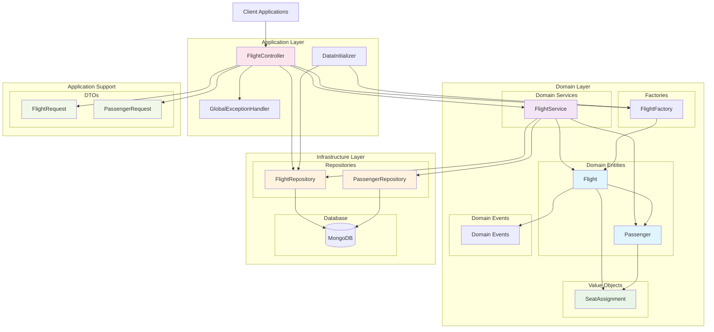
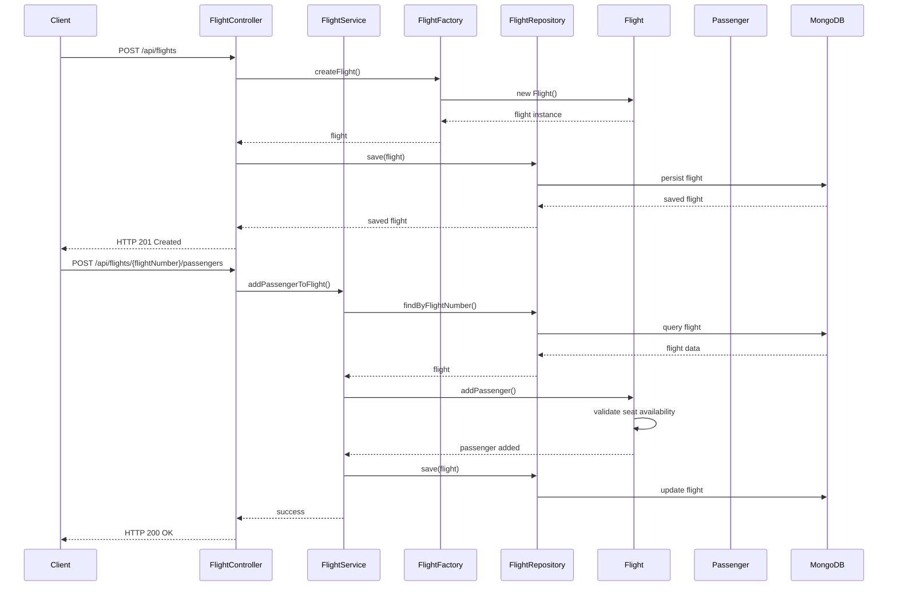
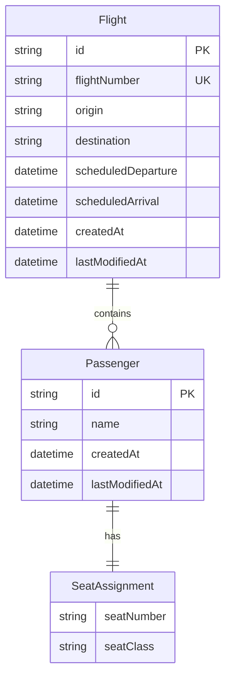
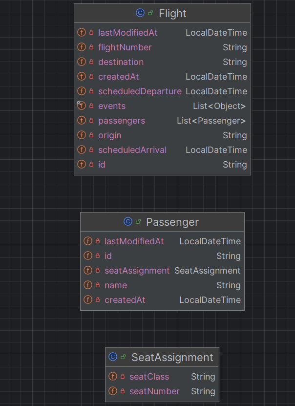

## Inspiration For the Project
[foojay's article on DDD in java](https://foojay.io/)

## System Architecture Overview



## Component Interaction Flow



## Domain Model Relationships



## DDD Layers and Responsibilities

### 1. **Domain Layer** (Core Business Logic)
- **Entities**: `Flight`, `Passenger` - Rich domain objects with business logic
- **Value Objects**: `SeatAssignment` - Immutable objects representing concepts
- **Domain Services**: `FlightService` - Complex business operations spanning multiple entities
- **Factories**: `FlightFactory` - Object creation with business rules
- **Domain Events**: Built into Flight entity for integration

### 2. **Application Layer** (Orchestration)
- **Controllers**: `FlightController` - REST API endpoints and request handling
- **DTOs**: `FlightRequest`, `PassengerRequest` - Data transfer objects
- **Exception Handling**: `GlobalExceptionHandler` - Centralized error handling

### 3. **Infrastructure Layer** (Technical Concerns)
- **Repositories**: `FlightRepository`, `PassengerRepository` - Data persistence abstraction
- **Database**: MongoDB - Data storage
- **Configuration**: `DataInitializer` - Application setup


## agrregates and entities
- entity: `Flight` - represents a scheduled flight
- entity: `Passenger` -  represents a traveler
- value object: `SeatAssignment`- represents descriptive attributes without identity. 
       describes a passenger’s seat via seatNumber and class (e.g., economy, business) and
       doesn’t exist standalone without a passenger.
- aggregate root: `Flight` - manages its passengers and their seat assignments

## implementing
- Another core DDD practice is to allow entities to publish domain events as 
- part of their business logic. In the airport context, 
- when a passenger is added to a flight, you may want to 
- raise an event (like `PassengerAddedEvent`) so the rest of the system 
- can respond (updating manifests, sending notifications, etc.). 
- A typical approach is using Spring’s domain events support.

[./src/main/java/com/example/airpot/domain](./src/main/java/com/example/airpot/domain)

- The separation of entities and value objects helps maintain clarity. 
- Entities have identity (`Flight`, `Passenger`), while value objects describe or 
- detail entities without unique identities (`SeatAssignment`).



## contexts and modularization
-  divide the application into bounded contexts
  - Flight operations: Handles flight scheduling, passenger management, and communications 
  - Passenger services: Manages check-in, boarding, and seat assignments 
  - Ground services: Could involve baggage handling and gate assignments, but omitted here for simplicity


## Repositories, domain services, and factories
- `Repositories`
  - domain model with databases or external systems.
  - `FlightRepository`, `PassengerRepository`
  - Repositories expose aggregate roots and entities for retrieval and persistence, 
  - without exposing database details to domain logic.
  - [./src/main/java/com/example/airpot/repository](./src/main/java/com/example/airpot/repository)
- `Domain services`
  - Domain services encapsulate business logic that involves multiple domain objects or 
  - doesn’t naturally fit in an entity or value object.
  - e.g.  `FlightService` that manages passenger assignments to flights ensuring no double seat bookings
  - [./src/main/java/com/example/airpot/domainservice](./src/main/java/com/example/airpot/domainservice)
- `Factories`
  - Factories create complex aggregate instances while encapsulating creation logic.
  - [./src/main/java/com/example/airpot/factory](./src/main/java/com/example/airpot/factory)

## Application layer and integration
- a simple REST controller integrated with your services, 
- exposing the core functionality to clients
- The API exposes aggregate-root operations and domain behavior aligned with business processes.
- [./src/main/java/com/example/airpot/controller](./src/main/java/com/example/airpot/controller)

## Testing and evolving the model
- core scenarios, like flight creation, adding passengers, etc.


## Endpoints
-  base url = `http://localhost:8090/api/flights`
- `get all flights`
```bash
 curl -X GET --location "http://localhost/api/flights"
```
- sampleOutput
  - [./sampleOutputs/getAllFlights.json](./sampleOutputs/getAllFlights.json)

- `Creates a new flight`
```bash
curl -X POST --location "http://localhost/api/flights" \
    -H "Content-Type: application/json" \
    -d '{
          "flightNumber": "MX90",
          "origin": "SSU",
          "destination": "PPM",
          "scheduledDeparture": "2025-12-25T10:00:00",
          "scheduledArrival": "2025-12-25T13:00:00"
        }'
```
- sampleOutput
  - [./sampleOutputs/createFlight.json](./sampleOutputs/createFlight.json)

- `Retrieves flights within a specific departure time range`
```bash
curl -X GET --location "http://localhost:8090/api/flights/departures?start=2025-08-24T14:00:00&end=2025-08-24T23:59:59"
```
- sampleOutput
  - [./sampleOutputs/specificdeparturerange.json](./sampleOutputs/specificdeparturerange.json)

- `Retrieves flights for a specific route`
```bash
curl -X GET --location "http://localhost:8090/api/flights/route?origin=JFK&destination=LAX"
```
- sampleOutput
  - [./sampleOutputs/specificLocation.json](./sampleOutputs/specificLocation.json)

- `Retrieve by Flight Number`
```bash
curl -X GET --location "http://localhost:8090/api/flights/UA101"
```
- sampleOutput
  - [./sampleOutputs/byFlightNumber.json](./sampleOutputs/byFlightNumber.json)

- `delete by flight number`
```bash
curl -X DELETE --location "http://localhost:8090/api/flights/UIC"
```
- sampleOutput
```text
Flight deleted successfully
```

- `Add a passenger to a specific flight`
```bash
curl -X POST --location "http://localhost:8090/api/flights/UIC/passengers" \
    -H "Content-Type: application/json" \
    -d '{
          "name": "Max J Smith",
          "seatNumber": "23A",
          "seatClass": "First Class"
        }'
```
- sampleOutput
```text
Passenger added successfully
```

- `Remove a passenger from a specific flight`
```bash
curl -X DELETE --location "http://localhost:8090/api/flights/UIC/passengers/68ab31ff565d959f4cdf06d6"
```
- sampleOutput
```text
Passenger removed successfully
```
